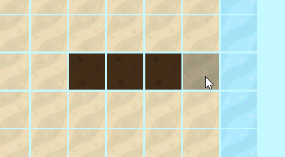
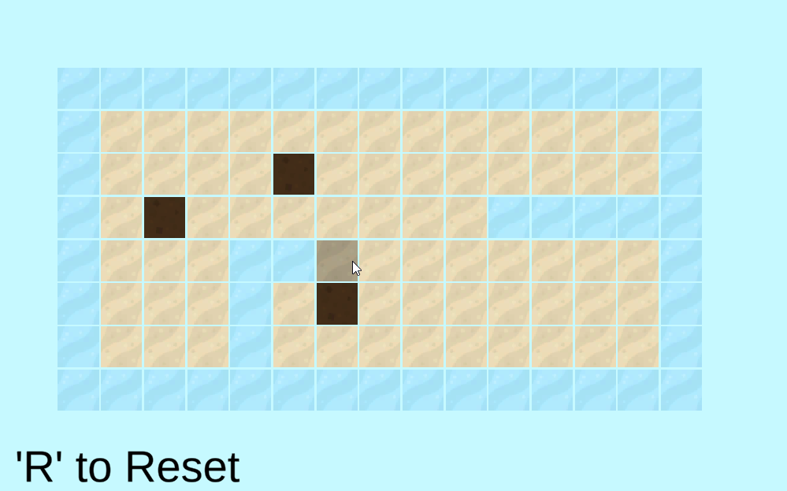
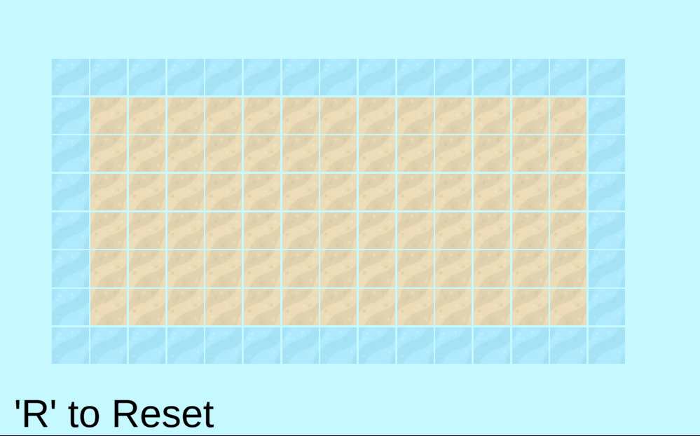
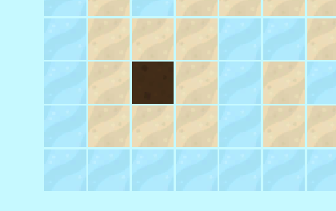
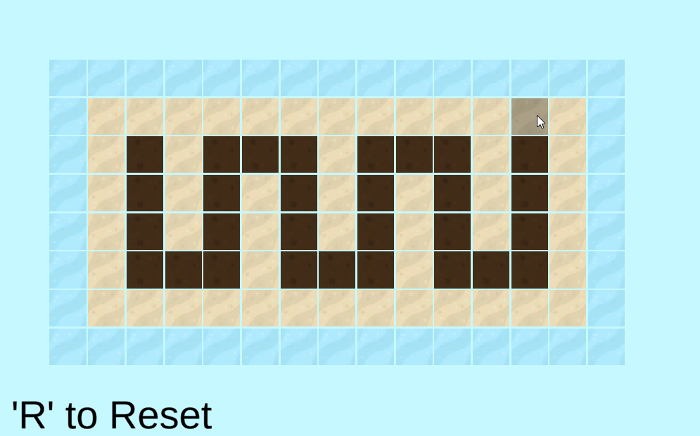

# Flooded Village <a href="https://archer01.itch.io/flooded-village">(Play game)</a>&nbsp;

 
  &nbsp
  &nbsp
  &nbsp
  &nbsp
  

---

## Résumé
Projet Unity répliquant le puzzle game flash d'irrigation Flooded Village

---

## Features
  * OnMouseClick sur les cases
  * Système pour checker les cases adjacentes avec une liste
  * Jeu d'irrigation

---

## Liens
  * <a href="https://www.youtube.com/channel/UCwxuydeEi6WyM-X6nsPs-8A">Youtube</a>
  * <a href="https://archer01.itch.io/">Itch.io</a>
  * <a href="https://hashnode.com/@Archer01">Hashnode (Dev Blog)</a>
  * <a href="https://www.linkedin.com/in/julienguenard/">Linkedin</a>
  * <a href="https://twitter.com/julien_guenard">Twitter</a>
